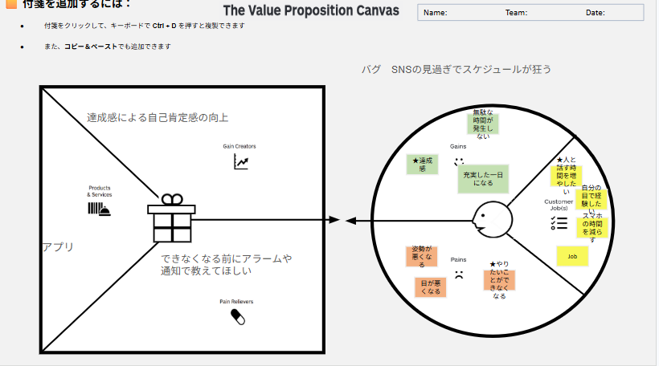

# VPC v1 - haruto1296

> 「**自分や周りの人を顧客に設定**」したVPC。13週後の自分が欲しいもの・身近な人のために作りたいものを設計する。
> v1 でいい。完璧を目指さない。第6回でアップデート(v2)します。

---

## 1. 解決したい困りごとを 1つ 選ぶ

> [`bug-list.md`](./bug-list.md) の20個から、**「自分が一番これを解決したい!」と思うもの** を1つ選んでください。
> 1つに絞れなければ、複数候補を書いてOK(後で絞り込みます)。

**選んだ困りごと**:

SNSの見過ぎでスケジュールが狂う

---

## 2. その解決策のアイデアを書く

> 選んだ困りごとに対する「**こうだったらいいのに**」を1つ書く。
> 現実性は気にせず、自由に発想。

**解決のアイデア**:

できなくなる前にアラームや通知で教えてくれる、達成感を感じられるアプリ

---

## 3. VPC本体

> 上で選んだ「困りごと」と「解決のアイデア」を起点に、6要素を埋めていきます。

### 🟦 Customer Profile(顧客=自分自身)

#### Jobs(やりたいこと・動詞で書く)

- スマホの時間を減らす
- 人と話す時間を増やしたい
- 自分の目で経験したい

#### Pains(困っていること)

- やりたいことができなくなる
- 姿勢が悪くなる
- 目が悪くなる

#### Gains(得たい未来・状態)

- 達成感
- 無駄な時間が発生しない
- 充実した一日になる

---

### 🟧 Value Map(あなたが作るもの)

#### Products & Services

- アプリ

#### Pain Relievers

- できなくなる前にアラームや通知で教えてほしい
- (姿勢や目の健康への配慮など)

#### Gain Creators

- 達成感による自己肯定感の向上
- (一日の充実度を可視化するなど)

---

## 4. Fit確認(整合チェック)

| Pains/Gains | ↔ | Pain Relievers / Gain Creators | チェック |
|---|---|---|---|
| やりたいことができなくなる | ↔ | アラームや通知で教えてくれる | ✓ |
| 姿勢・目が悪くなる | ↔ | (今後の検討課題) | - |
| - | ↔ | - | - |
| 達成感 | ↔ | 自己肯定感の向上 | ✓ |
| 一日の充実 | ↔ | 無駄な時間をなくす機能 | ✓ |

> 整合しないものは「自分が作りたいだけ」のプロダクトになりがち。
> 迷ったら AI大学講師に壁打ち。
